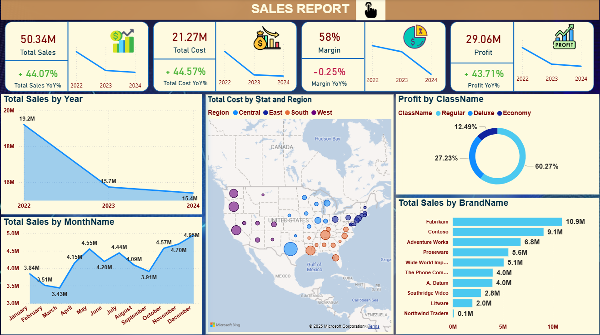

# 📊 Sales Report Dashboard - Power BI

This project is an **interactive Power BI dashboard** that provides detailed insights into **sales, cost, profit, margin, and brand performance** across multiple years, regions, and product classes.  
The report enables decision-makers to **track key metrics, identify trends, and analyze performance by geography and category**.

---

## 📌 Key Metrics (KPI Cards)
- **Total Sales**: 50.34M (+44.07% YoY)  
- **Total Cost**: 21.27M (+44.57% YoY)  
- **Margin**: 58% (-0.25% YoY)  
- **Profit**: 29.06M (+43.71% YoY)  

Each KPI includes **trend lines** from 2022 → 2024 for quick performance tracking.

---

## 📊 Visuals & Insights

### 1. **Total Sales by Year**
- Line chart showing yearly sales trend:
  - 2022 → 19.2M  
  - 2023 → 15.7M  
  - 2024 → 15.4M  

### 2. **Total Sales by Month**
- Monthly trend analysis:
  - Lowest: March (3.43M)  
  - Highest: December (4.95M)  
- Shows **seasonality in sales** (peaks in May, October, December).

### 3. **Total Cost by State and Region**
- Interactive **map visualization** of the U.S. with sales regions:
  - **Central, East, South, West** regions color-coded.
- Bubble size represents **cost intensity by state**.

### 4. **Profit by ClassName**
- Donut chart dividing profit by product class:
  - **Regular**: 60.27%  
  - **Deluxe**: 27.23%  
  - **Economy**: 12.49%  

### 5. **Total Sales by BrandName**
- Horizontal bar chart ranking top brands:
  - Fabrikam → 10.9M  
  - Contoso → 9.1M  
  - Adventure Works → 6.8M  
  - Proseware → 5.6M  
  - Wide World Importers → 5.1M  
  - The Phone Company → 4.0M  
  - A. Datum → 4.0M  
  - Southridge Video → 2.8M  
  - Litware → 2.0M  
  - Northwind Traders → 0.1M  

---

## 🛠 Tools & Technologies
- **Power BI Desktop**
- Data modeling with relationships between **sales, cost, and product tables**
- DAX measures for:
  - Year-over-Year (YoY) growth
  - Margin %
  - Profit calculations
- Interactive filters and slicers for **year, region, and product class**

---

## 🚀 How to Use
1. Open the `.pbix` file in **Power BI Desktop**.
2. Explore:
   - KPI cards for high-level insights.
   - **Yearly and monthly trends** in sales.
   - **Map view** for state/region performance.
   - **Donut chart** for profit by class.
   - **Brand-level performance** comparison.
3. Use filters to drill down by **year, class, or region**.

---

## 📌 Insights from Dashboard
- Despite sales decline from **2022 → 2024**, overall profit remained strong (+43.71% YoY).  
- **Regular class products** contribute the majority of profit (60%).  
- **Fabrikam** and **Contoso** are the leading brands in sales.  
- Sales show strong **seasonality**, with peaks in **May, October, and December**.  
- **Central & West regions** show higher cost concentration compared to East.  

---

## 📷 Screenshot

---

## 📂 Project Files
- `Sales_Report.SS.png` → Dashboard Screenshot  
- `Sales_Report.pbix` → Power B_
